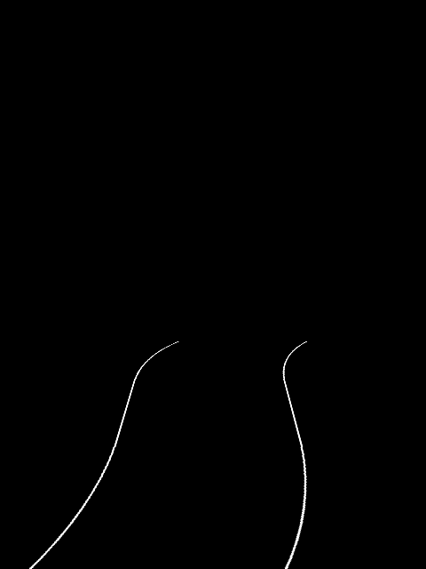
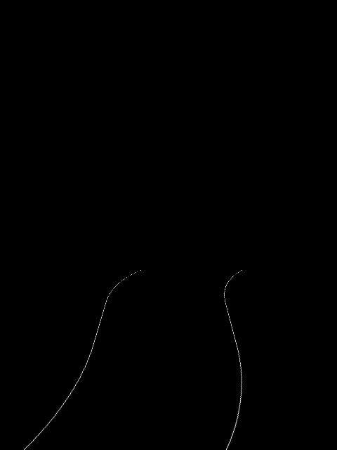
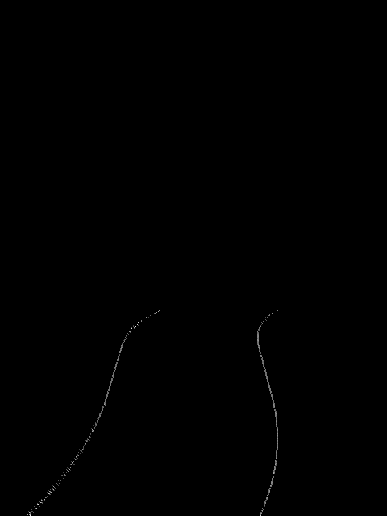
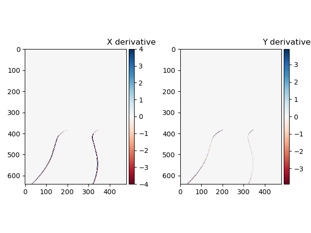
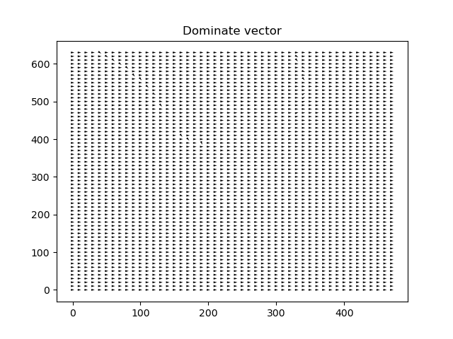
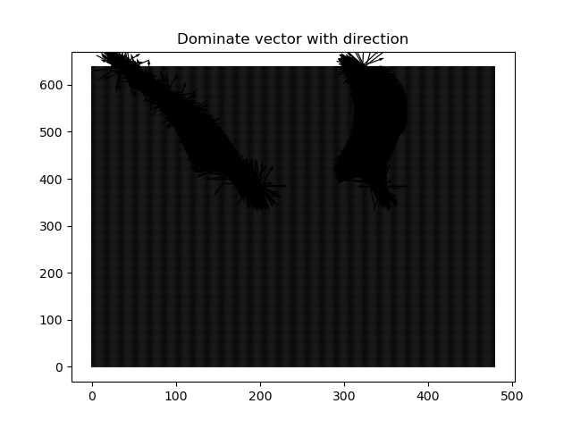
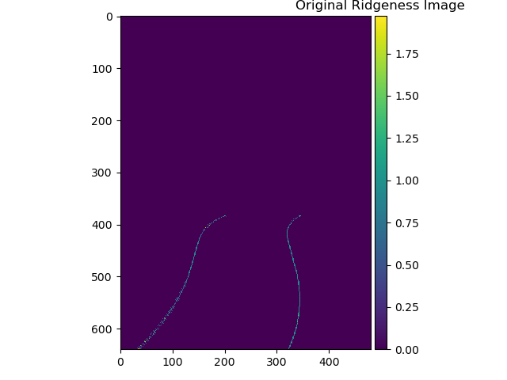
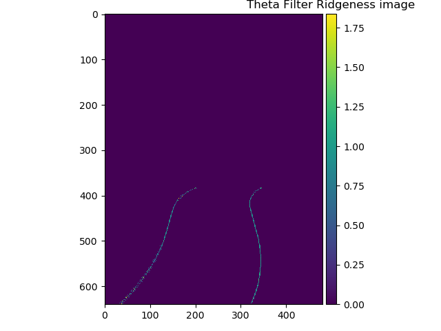

# test_double_curve_lane_single_line, width:2px  
[Go back to Summary](../summary.md)  
*0_input.png*  
  
*0_ridgeness_expect.png*  
  
*0_ridgeness_output.png*  
  
*unittest.png_01Input_image.png*  
  
*unittest.png_02Smooth_version_of_image.png*  
  
*unittest.png_03X_Y_derivative.png*  
  
*unittest.png_05dominant_vector.png*  
  
*unittest.png_06dominant_vector_with_direction.png*  
  
*unittest.png_07Original_Ridgeness_Image.png*  
  
*unittest.png_08Theta_Filter_Ridgeness_image.png*  
  
*unittest.png_09Confident_Filter_Image.png*  
  
